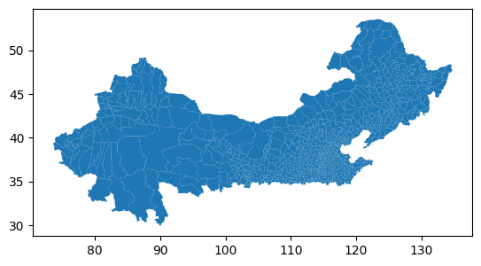
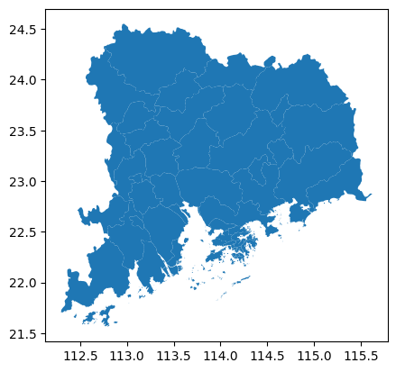
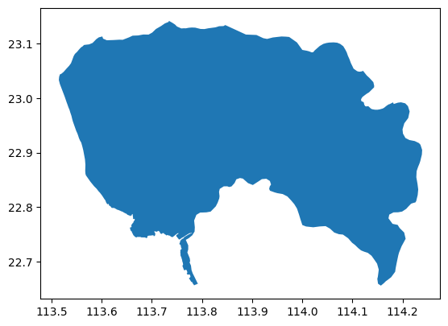
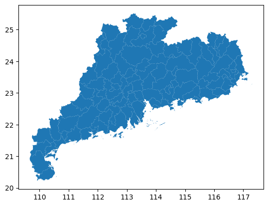

# 全球区划数据集的读取和定矩形区域、定点索引
所需第三方库：geopandas
使用数据库：GAMD_410, 下载地址：https://gadm.org/download_world.html ，该数据集较为精细，唯一需要注意的是使用时的某些政治问题，谨慎对待

这种gpkg数据库也可以用开源的QGIS打开，方便快速可视化

geopandas是在pandas基础上开发的，很多基本的操作相通，也增加了一些方法和索引器之类


```python
import geopandas as gpd
```


```python
gamd_path = "H:\\Region\\GAMD_410\\gadm_410.gpkg"
gamd_file = gpd.read_file(gamd_path)
gamd_file
```


<div>
<style scoped>
    .dataframe tbody tr th:only-of-type {
        vertical-align: middle;
    }

    .dataframe tbody tr th {
        vertical-align: top;
    }

    .dataframe thead th {
        text-align: right;
    }
</style>
<table border="1" class="dataframe">
  <thead>
    <tr style="text-align: right;">
      <th></th>
      <th>UID</th>
      <th>GID_0</th>
      <th>NAME_0</th>
      <th>VARNAME_0</th>
      <th>GID_1</th>
      <th>NAME_1</th>
      <th>VARNAME_1</th>
      <th>NL_NAME_1</th>
      <th>ISO_1</th>
      <th>HASC_1</th>
      <th>...</th>
      <th>ENGTYPE_5</th>
      <th>GOVERNEDBY</th>
      <th>SOVEREIGN</th>
      <th>DISPUTEDBY</th>
      <th>REGION</th>
      <th>VARREGION</th>
      <th>COUNTRY</th>
      <th>CONTINENT</th>
      <th>SUBCONT</th>
      <th>geometry</th>
    </tr>
  </thead>
  <tbody>
    <tr>
      <th>0</th>
      <td>1</td>
      <td>AFG</td>
      <td>Afghanistan</td>
      <td></td>
      <td>AFG.1_1</td>
      <td>Badakhshan</td>
      <td>Badahšan</td>
      <td></td>
      <td></td>
      <td>AF.BD</td>
      <td>...</td>
      <td></td>
      <td></td>
      <td>Afghanistan</td>
      <td></td>
      <td></td>
      <td></td>
      <td>Afghanistan</td>
      <td>Asia</td>
      <td></td>
      <td>MULTIPOLYGON (((71.41149 36.55717, 71.40954 36...</td>
    </tr>
    <tr>
      <th>1</th>
      <td>2</td>
      <td>AFG</td>
      <td>Afghanistan</td>
      <td></td>
      <td>AFG.1_1</td>
      <td>Badakhshan</td>
      <td>Badahšan</td>
      <td></td>
      <td></td>
      <td>AF.BD</td>
      <td>...</td>
      <td></td>
      <td></td>
      <td>Afghanistan</td>
      <td></td>
      <td></td>
      <td></td>
      <td>Afghanistan</td>
      <td>Asia</td>
      <td></td>
      <td>MULTIPOLYGON (((71.27620 38.00465, 71.27578 38...</td>
    </tr>
    <tr>
      <th>2</th>
      <td>3</td>
      <td>AFG</td>
      <td>Afghanistan</td>
      <td></td>
      <td>AFG.1_1</td>
      <td>Badakhshan</td>
      <td>Badahšan</td>
      <td></td>
      <td></td>
      <td>AF.BD</td>
      <td>...</td>
      <td></td>
      <td></td>
      <td>Afghanistan</td>
      <td></td>
      <td></td>
      <td></td>
      <td>Afghanistan</td>
      <td>Asia</td>
      <td></td>
      <td>MULTIPOLYGON (((70.78272 37.27678, 70.78635 37...</td>
    </tr>
    <tr>
      <th>3</th>
      <td>4</td>
      <td>AFG</td>
      <td>Afghanistan</td>
      <td></td>
      <td>AFG.1_1</td>
      <td>Badakhshan</td>
      <td>Badahšan</td>
      <td></td>
      <td></td>
      <td>AF.BD</td>
      <td>...</td>
      <td></td>
      <td></td>
      <td>Afghanistan</td>
      <td></td>
      <td></td>
      <td></td>
      <td>Afghanistan</td>
      <td>Asia</td>
      <td></td>
      <td>MULTIPOLYGON (((71.41149 36.55717, 71.40091 36...</td>
    </tr>
    <tr>
      <th>4</th>
      <td>5</td>
      <td>AFG</td>
      <td>Afghanistan</td>
      <td></td>
      <td>AFG.1_1</td>
      <td>Badakhshan</td>
      <td>Badahšan</td>
      <td></td>
      <td></td>
      <td>AF.BD</td>
      <td>...</td>
      <td></td>
      <td></td>
      <td>Afghanistan</td>
      <td></td>
      <td></td>
      <td></td>
      <td>Afghanistan</td>
      <td>Asia</td>
      <td></td>
      <td>MULTIPOLYGON (((70.71236 37.07621, 70.73582 37...</td>
    </tr>
    <tr>
      <th>...</th>
      <td>...</td>
      <td>...</td>
      <td>...</td>
      <td>...</td>
      <td>...</td>
      <td>...</td>
      <td>...</td>
      <td>...</td>
      <td>...</td>
      <td>...</td>
      <td>...</td>
      <td>...</td>
      <td>...</td>
      <td>...</td>
      <td>...</td>
      <td>...</td>
      <td>...</td>
      <td>...</td>
      <td>...</td>
      <td>...</td>
      <td>...</td>
    </tr>
    <tr>
      <th>356503</th>
      <td>356504</td>
      <td>ZWE</td>
      <td>Zimbabwe</td>
      <td></td>
      <td>ZWE.10_1</td>
      <td>Midlands</td>
      <td></td>
      <td></td>
      <td>ZW-MI</td>
      <td>ZW.MI</td>
      <td>...</td>
      <td></td>
      <td></td>
      <td>Zimbabwe</td>
      <td></td>
      <td></td>
      <td></td>
      <td>Zimbabwe</td>
      <td>Africa</td>
      <td></td>
      <td>MULTIPOLYGON (((29.75637 -20.33492, 29.75664 -...</td>
    </tr>
    <tr>
      <th>356504</th>
      <td>356505</td>
      <td>ZWE</td>
      <td>Zimbabwe</td>
      <td></td>
      <td>ZWE.10_1</td>
      <td>Midlands</td>
      <td></td>
      <td></td>
      <td>ZW-MI</td>
      <td>ZW.MI</td>
      <td>...</td>
      <td></td>
      <td></td>
      <td>Zimbabwe</td>
      <td></td>
      <td></td>
      <td></td>
      <td>Zimbabwe</td>
      <td>Africa</td>
      <td></td>
      <td>MULTIPOLYGON (((29.84425 -20.10055, 29.84955 -...</td>
    </tr>
    <tr>
      <th>356505</th>
      <td>356506</td>
      <td>ZWE</td>
      <td>Zimbabwe</td>
      <td></td>
      <td>ZWE.10_1</td>
      <td>Midlands</td>
      <td></td>
      <td></td>
      <td>ZW-MI</td>
      <td>ZW.MI</td>
      <td>...</td>
      <td></td>
      <td></td>
      <td>Zimbabwe</td>
      <td></td>
      <td></td>
      <td></td>
      <td>Zimbabwe</td>
      <td>Africa</td>
      <td></td>
      <td>MULTIPOLYGON (((30.03103 -20.27994, 30.03089 -...</td>
    </tr>
    <tr>
      <th>356506</th>
      <td>356507</td>
      <td>ZWE</td>
      <td>Zimbabwe</td>
      <td></td>
      <td>ZWE.10_1</td>
      <td>Midlands</td>
      <td></td>
      <td></td>
      <td>ZW-MI</td>
      <td>ZW.MI</td>
      <td>...</td>
      <td></td>
      <td></td>
      <td>Zimbabwe</td>
      <td></td>
      <td></td>
      <td></td>
      <td>Zimbabwe</td>
      <td>Africa</td>
      <td></td>
      <td>MULTIPOLYGON (((30.08165 -20.19866, 30.08120 -...</td>
    </tr>
    <tr>
      <th>356507</th>
      <td>356508</td>
      <td>ZWE</td>
      <td>Zimbabwe</td>
      <td></td>
      <td>ZWE.10_1</td>
      <td>Midlands</td>
      <td></td>
      <td></td>
      <td>ZW-MI</td>
      <td>ZW.MI</td>
      <td>...</td>
      <td></td>
      <td></td>
      <td>Zimbabwe</td>
      <td></td>
      <td></td>
      <td></td>
      <td>Zimbabwe</td>
      <td>Africa</td>
      <td></td>
      <td>MULTIPOLYGON (((30.18608 -20.07877, 30.18606 -...</td>
    </tr>
  </tbody>
</table>
<p>356508 rows × 53 columns</p>
</div>


数据库中每条记录都是一个最小区划的多边形（最后一列geometry中的MULTIPOLYGON类就是通过大量经纬度点描绘的多边形），包含多层区划，如NAME_0一般代表国家（并没有对应说明type，不绝对代表国家），而NAME_1常代表省（ENGTYPE: Province）。


```python
china = gamd_file[gamd_file["NAME_0"] == "China"]
del gamd_file
china
```


<div>
<style scoped>
    .dataframe tbody tr th:only-of-type {
        vertical-align: middle;
    }

    .dataframe tbody tr th {
        vertical-align: top;
    }

    .dataframe thead th {
        text-align: right;
    }
</style>
<table border="1" class="dataframe">
  <thead>
    <tr style="text-align: right;">
      <th></th>
      <th>UID</th>
      <th>GID_0</th>
      <th>NAME_0</th>
      <th>VARNAME_0</th>
      <th>GID_1</th>
      <th>NAME_1</th>
      <th>VARNAME_1</th>
      <th>NL_NAME_1</th>
      <th>ISO_1</th>
      <th>HASC_1</th>
      <th>...</th>
      <th>ENGTYPE_5</th>
      <th>GOVERNEDBY</th>
      <th>SOVEREIGN</th>
      <th>DISPUTEDBY</th>
      <th>REGION</th>
      <th>VARREGION</th>
      <th>COUNTRY</th>
      <th>CONTINENT</th>
      <th>SUBCONT</th>
      <th>geometry</th>
    </tr>
  </thead>
  <tbody>
    <tr>
      <th>42435</th>
      <td>42436</td>
      <td>CHN</td>
      <td>China</td>
      <td></td>
      <td>CHN.1_1</td>
      <td>Anhui</td>
      <td>Ānhuī</td>
      <td>安徽|安徽</td>
      <td>CN-AH</td>
      <td>CN.AH</td>
      <td>...</td>
      <td></td>
      <td></td>
      <td>China</td>
      <td></td>
      <td></td>
      <td></td>
      <td>China</td>
      <td>Asia</td>
      <td></td>
      <td>MULTIPOLYGON (((117.01215 30.49605, 117.00874 ...</td>
    </tr>
    <tr>
      <th>42436</th>
      <td>42437</td>
      <td>CHN</td>
      <td>China</td>
      <td></td>
      <td>CHN.1_1</td>
      <td>Anhui</td>
      <td>Ānhuī</td>
      <td>安徽|安徽</td>
      <td>CN-AH</td>
      <td>CN.AH</td>
      <td>...</td>
      <td></td>
      <td></td>
      <td>China</td>
      <td></td>
      <td></td>
      <td></td>
      <td>China</td>
      <td>Asia</td>
      <td></td>
      <td>MULTIPOLYGON (((117.04400 30.66469, 117.04181 ...</td>
    </tr>
    <tr>
      <th>42437</th>
      <td>42438</td>
      <td>CHN</td>
      <td>China</td>
      <td></td>
      <td>CHN.1_1</td>
      <td>Anhui</td>
      <td>Ānhuī</td>
      <td>安徽|安徽</td>
      <td>CN-AH</td>
      <td>CN.AH</td>
      <td>...</td>
      <td></td>
      <td></td>
      <td>China</td>
      <td></td>
      <td></td>
      <td></td>
      <td>China</td>
      <td>Asia</td>
      <td></td>
      <td>MULTIPOLYGON (((116.76235 30.82385, 116.75951 ...</td>
    </tr>
    <tr>
      <th>42438</th>
      <td>42439</td>
      <td>CHN</td>
      <td>China</td>
      <td></td>
      <td>CHN.1_1</td>
      <td>Anhui</td>
      <td>Ānhuī</td>
      <td>安徽|安徽</td>
      <td>CN-AH</td>
      <td>CN.AH</td>
      <td>...</td>
      <td></td>
      <td></td>
      <td>China</td>
      <td></td>
      <td></td>
      <td></td>
      <td>China</td>
      <td>Asia</td>
      <td></td>
      <td>MULTIPOLYGON (((115.93915 30.42734, 115.94868 ...</td>
    </tr>
    <tr>
      <th>42439</th>
      <td>42440</td>
      <td>CHN</td>
      <td>China</td>
      <td></td>
      <td>CHN.1_1</td>
      <td>Anhui</td>
      <td>Ānhuī</td>
      <td>安徽|安徽</td>
      <td>CN-AH</td>
      <td>CN.AH</td>
      <td>...</td>
      <td></td>
      <td></td>
      <td>China</td>
      <td></td>
      <td></td>
      <td></td>
      <td>China</td>
      <td>Asia</td>
      <td></td>
      <td>MULTIPOLYGON (((116.47166 30.45662, 116.47373 ...</td>
    </tr>
    <tr>
      <th>...</th>
      <td>...</td>
      <td>...</td>
      <td>...</td>
      <td>...</td>
      <td>...</td>
      <td>...</td>
      <td>...</td>
      <td>...</td>
      <td>...</td>
      <td>...</td>
      <td>...</td>
      <td>...</td>
      <td>...</td>
      <td>...</td>
      <td>...</td>
      <td>...</td>
      <td>...</td>
      <td>...</td>
      <td>...</td>
      <td>...</td>
      <td>...</td>
    </tr>
    <tr>
      <th>44865</th>
      <td>44866</td>
      <td>CHN</td>
      <td>China</td>
      <td></td>
      <td>CHN.31_1</td>
      <td>Zhejiang</td>
      <td>Zhèjiāng</td>
      <td>浙江</td>
      <td>CN-ZJ</td>
      <td>CN.ZJ</td>
      <td>...</td>
      <td></td>
      <td></td>
      <td>China</td>
      <td></td>
      <td></td>
      <td></td>
      <td>China</td>
      <td>Asia</td>
      <td></td>
      <td>MULTIPOLYGON (((120.74319 28.02431, 120.74319 ...</td>
    </tr>
    <tr>
      <th>44866</th>
      <td>44867</td>
      <td>CHN</td>
      <td>China</td>
      <td></td>
      <td>CHN.31_1</td>
      <td>Zhejiang</td>
      <td>Zhèjiāng</td>
      <td>浙江</td>
      <td>CN-ZJ</td>
      <td>CN.ZJ</td>
      <td>...</td>
      <td></td>
      <td></td>
      <td>China</td>
      <td></td>
      <td></td>
      <td></td>
      <td>China</td>
      <td>Asia</td>
      <td></td>
      <td>MULTIPOLYGON (((121.12264 27.69097, 121.12264 ...</td>
    </tr>
    <tr>
      <th>44867</th>
      <td>44868</td>
      <td>CHN</td>
      <td>China</td>
      <td></td>
      <td>CHN.31_1</td>
      <td>Zhejiang</td>
      <td>Zhèjiāng</td>
      <td>浙江</td>
      <td>CN-ZJ</td>
      <td>CN.ZJ</td>
      <td>...</td>
      <td></td>
      <td></td>
      <td>China</td>
      <td></td>
      <td></td>
      <td></td>
      <td>China</td>
      <td>Asia</td>
      <td></td>
      <td>MULTIPOLYGON (((122.16570 30.13764, 122.16570 ...</td>
    </tr>
    <tr>
      <th>44868</th>
      <td>44869</td>
      <td>CHN</td>
      <td>China</td>
      <td></td>
      <td>CHN.31_1</td>
      <td>Zhejiang</td>
      <td>Zhèjiāng</td>
      <td>浙江</td>
      <td>CN-ZJ</td>
      <td>CN.ZJ</td>
      <td>...</td>
      <td></td>
      <td></td>
      <td>China</td>
      <td></td>
      <td></td>
      <td></td>
      <td>China</td>
      <td>Asia</td>
      <td></td>
      <td>MULTIPOLYGON (((122.12514 29.94847, 122.12514 ...</td>
    </tr>
    <tr>
      <th>44869</th>
      <td>44870</td>
      <td>CHN</td>
      <td>China</td>
      <td></td>
      <td>CHN.31_1</td>
      <td>Zhejiang</td>
      <td>Zhèjiāng</td>
      <td>浙江</td>
      <td>CN-ZJ</td>
      <td>CN.ZJ</td>
      <td>...</td>
      <td></td>
      <td></td>
      <td>China</td>
      <td></td>
      <td></td>
      <td></td>
      <td>China</td>
      <td>Asia</td>
      <td></td>
      <td>MULTIPOLYGON (((122.15986 29.61153, 122.15986 ...</td>
    </tr>
  </tbody>
</table>
<p>2435 rows × 53 columns</p>
</div>


cx索引器可以也只可以用于索引经纬度范围，只要该区划选取的矩形区域有重叠就会被选取，我觉得可能判断某个经纬度点属于哪个区划会更重要一点（？


```python
china.cx[:, 35:].plot()
```


    <AxesSubplot:>


    

    


```python
china.cx[113: 115, 22: 24].plot()
```


    <AxesSubplot:>


    

    


```python
# 东莞区划的多边形，顺便一提东莞最细就到整个东莞的区划，广州的话还分为了几个区
china[china["NAME_2"] == "Dongguan"]["geometry"]
```


    42706    MULTIPOLYGON (((114.12109 23.05014, 114.12822 ...
    Name: geometry, dtype: geometry


```python
china[china["NAME_2"] == "Dongguan"]
```


<div>
<style scoped>
    .dataframe tbody tr th:only-of-type {
        vertical-align: middle;
    }

    .dataframe tbody tr th {
        vertical-align: top;
    }

    .dataframe thead th {
        text-align: right;
    }
</style>
<table border="1" class="dataframe">
  <thead>
    <tr style="text-align: right;">
      <th></th>
      <th>UID</th>
      <th>GID_0</th>
      <th>NAME_0</th>
      <th>VARNAME_0</th>
      <th>GID_1</th>
      <th>NAME_1</th>
      <th>VARNAME_1</th>
      <th>NL_NAME_1</th>
      <th>ISO_1</th>
      <th>HASC_1</th>
      <th>...</th>
      <th>ENGTYPE_5</th>
      <th>GOVERNEDBY</th>
      <th>SOVEREIGN</th>
      <th>DISPUTEDBY</th>
      <th>REGION</th>
      <th>VARREGION</th>
      <th>COUNTRY</th>
      <th>CONTINENT</th>
      <th>SUBCONT</th>
      <th>geometry</th>
    </tr>
  </thead>
  <tbody>
    <tr>
      <th>42706</th>
      <td>42707</td>
      <td>CHN</td>
      <td>China</td>
      <td></td>
      <td>CHN.6_1</td>
      <td>Guangdong</td>
      <td>Guǎngdōng</td>
      <td>廣東|广东</td>
      <td>CN-GD</td>
      <td>CN.GD</td>
      <td>...</td>
      <td></td>
      <td></td>
      <td>China</td>
      <td></td>
      <td></td>
      <td></td>
      <td>China</td>
      <td>Asia</td>
      <td></td>
      <td>MULTIPOLYGON (((114.12109 23.05014, 114.12822 ...</td>
    </tr>
  </tbody>
</table>
<p>1 rows × 53 columns</p>
</div>


```python
# 单点索引办法：contains，适用于单列，即GeoSeries

from shapely.geometry import Point
test = Point(113.9, 22.9)

# 单点索引到东莞市
china[china["NAME_2"] == china[china["geometry"].contains(test)]["NAME_2"].iloc[0]].plot()
```


    <AxesSubplot:>


    

    


```python
# 单点索引到整个广东
china[china["NAME_1"] == china[china["geometry"].contains(test)]["NAME_1"].iloc[0]].plot()
```


    <AxesSubplot:>


    

    


```python

```
